PHP Arrays and Control Structures
=================================

In this course we'll be building on the foundational skills covered in the first PHP Basics course. We'll explore conditionals, loops and the compound variable, arrays, all of which help you write more powerful and intelligent programs using less code. We'll utilize these new skill by building several projects: Custom Messages for High School Students, a ping pong game and a todo app.

Logical Operators
-----------------

If we want to check for multiple conditions at once, we can combine conditional statements using logical operators.

Switch Case Statements
----------------------

PHP provides another control structure called a "switch" statement. Switch statements are similar to a series of IF statements that use the same expression. Switch statements allow you to compare many different values with the same variable or expression. For example: you may want to look at the day of the week, and perform different actions based on which day of the week it is.

Indexed Arrays
--------------

An array is a compound variable type meaning it can contain more than one value.

Arrays in PHP are actually ordered maps. A map is a type that associates values to keys. This type is optimized for several different uses; it can be treated as an array, list (vector), hash table (an implementation of a map), dictionary, collection, stack, queue, and probably more. As array values can be other arrays, trees and multidimensional arrays are also possible.

Adding Array Elements
---------------------

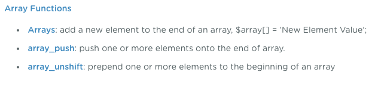

More info on PHP Array Functions: http://php.net/manual/en/ref.array.php

Removing Array Elements
-----------------------

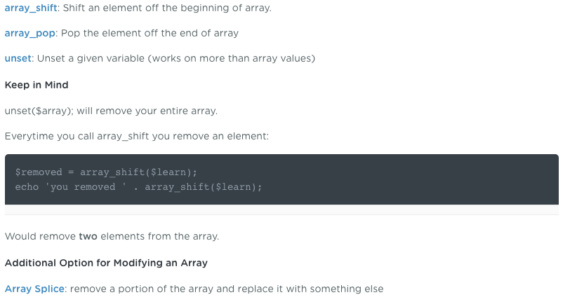

More info on PHP Array Functions: http://php.net/manual/en/ref.array.php

Ediing Array Elements
---------------------

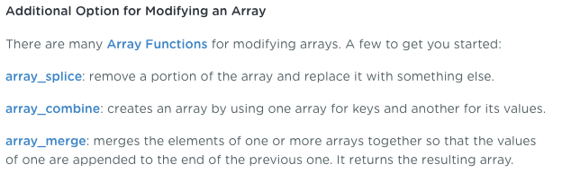

Associative Arrays
------------------

You can assign your own keys to array elements -- and they don't have to be numbers. In fact, your code can be easier to read and understand if you use a name for a key. This is called an Associative Array, because a specific key is associated with a specific value.

Arrays are also referred to as a hash or dictionary

Comma After Elements

The comma after the last array element is optional and can be omitted. This is usually done for single-line arrays, i.e. array(1, 2) is preferred over array(1, 2, ). For multi-line arrays on the other hand the trailing comma is commonly used, as it allows easier addition of new elements at the end.

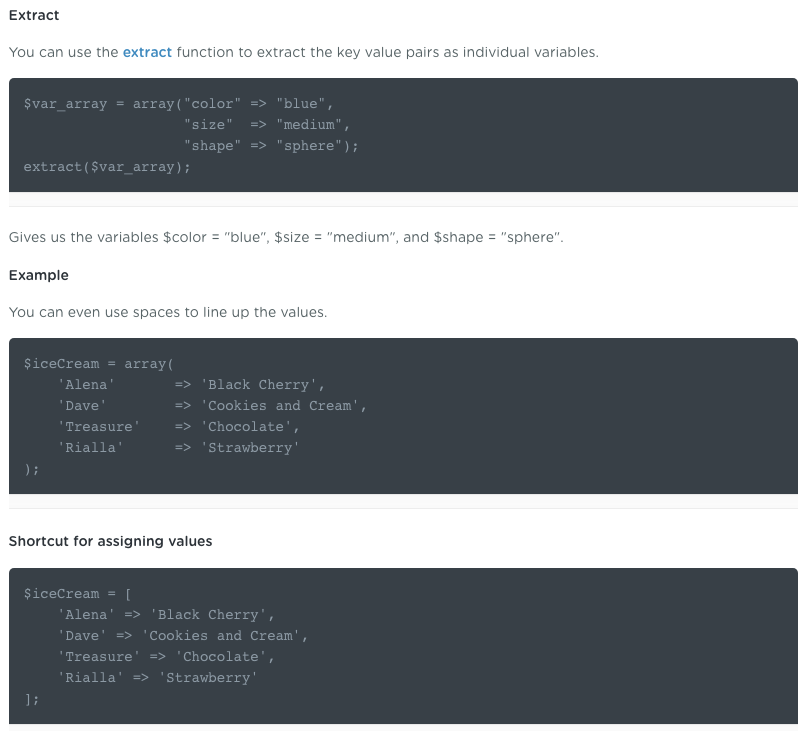

Mixing Data Types in Arrays
---------------------------

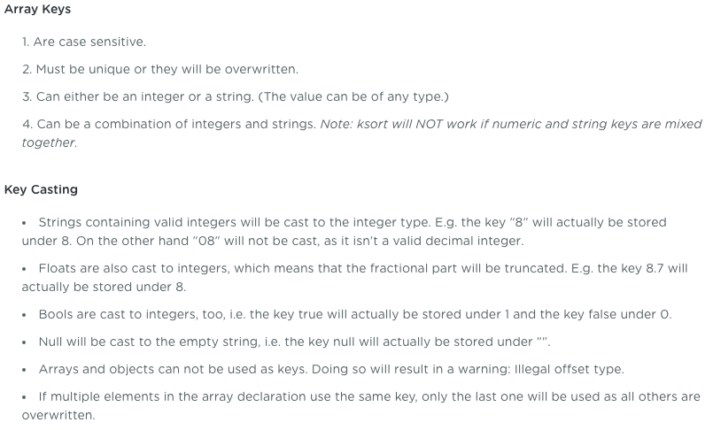

Multidimensional Arrays
-----------------------

Multidimensional arrays allow me to create an nested array of information for each item in my list. In this video we'll take a look at the format for creating multidimensional arrays.

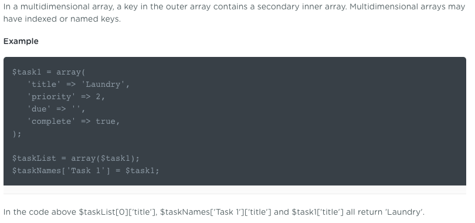

Sorting Arrays
--------------

What makes grouping variables in an array so useful? One of the extra tools arrays give us is the ability to sort. Sorting allows us to organize large amounts of data. We can sort by key or value, increasing the usefulness of our data.

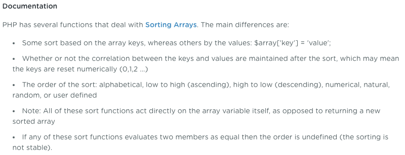
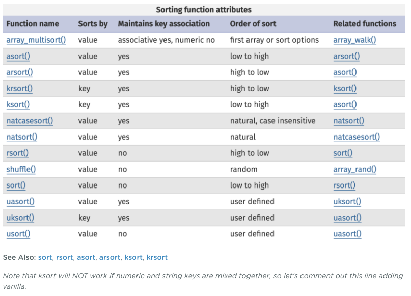

Doing While Looping
-------------------

In programming, a loop is a way to repeat the same actions a certain number of times, or until a certain condition is true. Instead of typing the exact same code, a loop will allow us to write that code one time then repeat that code WHILE a condition is true.

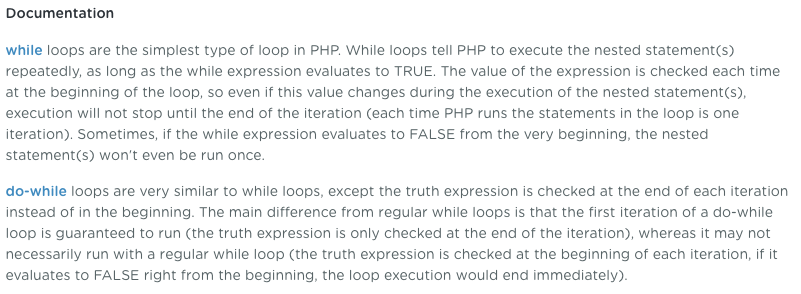

While Listing Array Values
--------------------------

Arrays are a collection of items, which mean that, often times, we want to do the same thing with each item in the array. Loops allow us to do just that. We can loop through an entire array, or part of an array, and perform any number of actions on each item. In this video we'll use our while loop to loop through the todo list.

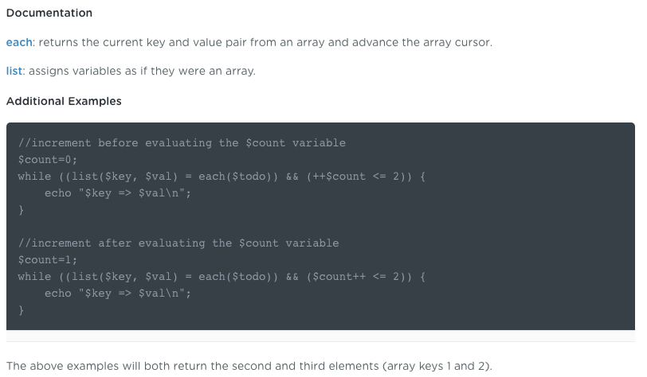

For Loops
---------

for loops are the most complex loops in PHP because the contain three expressions. The first expression (expr1) is evaluated (executed) once unconditionally at the beginning of the loop.

In the beginning of each iteration, expr2 is evaluated. If it evaluates to TRUE, the loop continues and the nested statement(s) are executed. If it evaluates to FALSE, the execution of the loop ends.

At the end of each iteration, expr3 is evaluated (executed).

Each of the expressions can be empty or contain multiple expressions separated by commas.

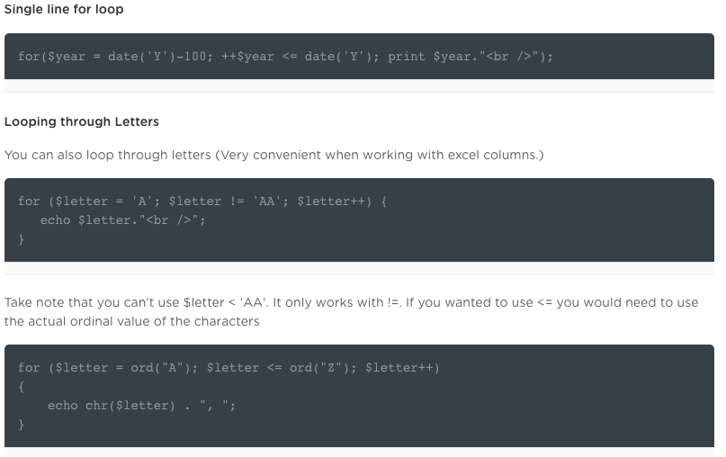

Foreach Loops
-------------

foreach loops will allow you to grab the value and optionally the key, but not the key on its own.

You can use foreach loops with any type of array, and your array can have any key value. You can choose to grab just the item value or the key value as well. A foreach loop is a lot like combining the WHILE statement with the each function, only even easier.

The next loop we'll look at is a "for loop". for loops are the most complex loops in PHP because they use three expressions instead of just one.

Notes
-----

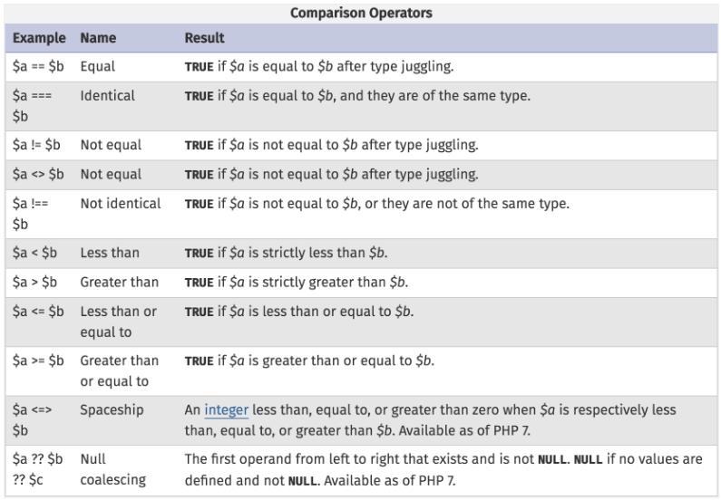
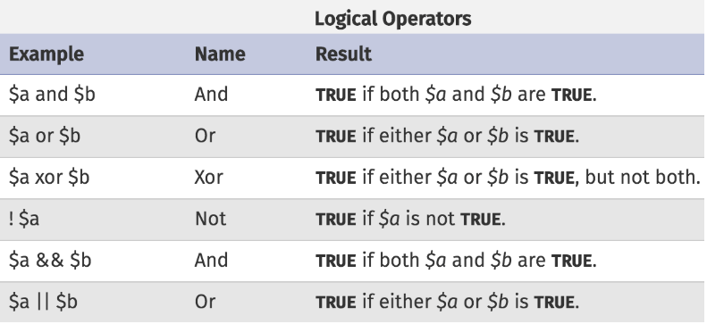
